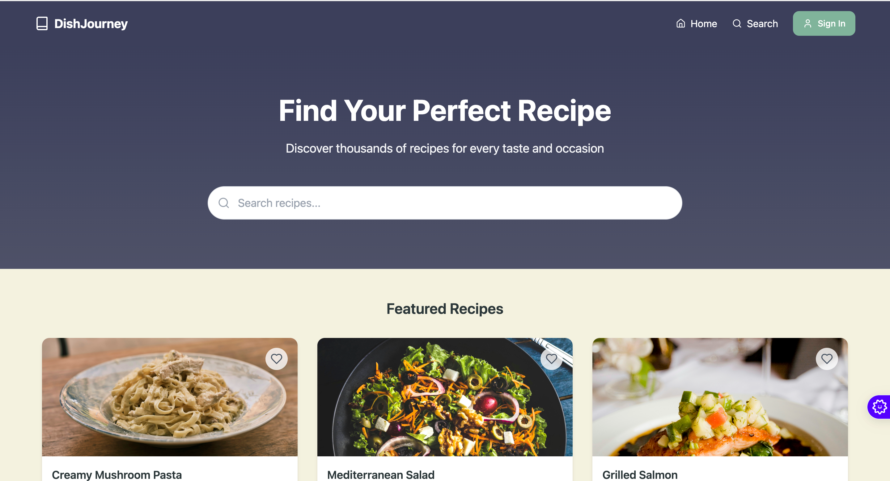
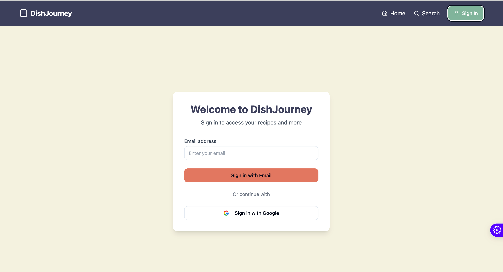
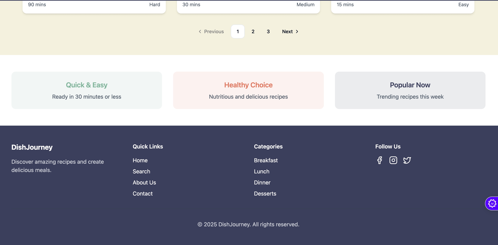

# Dish Journey 🍽️






## About 📖
Dish Journey is a web application that brings the joy of cooking to your fingertips! It's your personal culinary companion, designed to help you discover, save, and share delicious recipes from around the world. Whether you're a seasoned chef or just starting your cooking adventure, Dish Journey makes exploring new flavors and techniques fun and accessible.

## Features ✨
- **Recipe Discovery**: Browse through a vast collection of curated recipes from various cuisines and skill levels
- **Smart Search**: Find recipes by ingredients, cuisine type, cooking time, or dietary restrictions
- **Interactive Cooking Mode**: Step-by-step cooking instructions with timers and ingredient checklist
- **Personal Recipe Box**: Save your favorite recipes and create custom collections
- **Community Sharing**: Share your cooking experiences and connect with other food enthusiasts

## Tech Stack 🛠️
This project is crafted with modern technologies for the best development experience:

- Vite - Lightning fast build tool
- TypeScript - For type-safe code
- React - UI framework
- shadcn-ui - Beautiful and accessible components
- Tailwind CSS - Utility-first CSS framework

## Installation 🚀

```bash
# Install dependencies
npm install

# Start development server
npm run dev
```

## Usage Guide 📱
1. **Browse Recipes**: Explore the homepage to discover featured recipes
2. **Search**: Use the search bar to find specific recipes or filter by categories
3. **View Details**: Click on any recipe to see detailed instructions and ingredients
4. **Save Favorites**: Create an account to save your favorite recipes
5. **Share**: Share recipes with friends through social media integration

## Contributing 🤝
We love contributions! Here's how you can help:

1. Fork the repository
2. Create your feature branch (`git checkout -b feature/AmazingFeature`)
3. Commit your changes (`git commit -m 'Add some AmazingFeature'`)
4. Push to the branch (`git push origin feature/AmazingFeature`)
5. Open a Pull Request

## License 📄
[MIT](https://choosealicense.com/licenses/mit/) - Feel free to use this project for your own purposes!

## Project Info 🔍
**URL**: https://lovable.dev/projects/8b1c511d-1d78-4198-93ac-3f4819a070ae

## Development Options 💻

### Use Lovable
Visit the [Lovable Project](https://lovable.dev/projects/8b1c511d-1d78-4198-93ac-3f4819a070ae) to start developing with AI assistance. Changes are automatically committed to the repository.

### Local Development
Requirements: Node.js & npm - [install with nvm](https://github.com/nvm-sh/nvm#installing-and-updating)

```sh
# Clone the repository
git clone https://github.com/TabbyMichael/dish-journey

# Navigate to project directory
cd dish-journey

# Install dependencies
npm install

# Start development server
npm run dev
```

### Direct GitHub Editing
- Navigate to the file you want to edit
- Click the pencil icon (Edit)
- Make your changes
- Commit directly to the repository

### GitHub Codespaces
1. Go to the repository's main page
2. Click "Code" (green button)
3. Select "Codespaces"
4. Click "New codespace"

## Deployment 🌐
Deploy your project easily through [Lovable](https://lovable.dev/projects/8b1c511d-1d78-4198-93ac-3f4819a070ae) - just click Share -> Publish.

## Custom Domain Setup 🌍
While custom domains aren't directly supported yet, you can deploy to Netlify for this feature. Check our [Custom domains documentation](https://docs.lovable.dev/tips-tricks/custom-domain/) for detailed instructions.

---

⭐ Don't forget to star this repository if you find it helpful! ⭐
